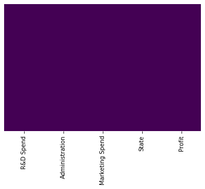
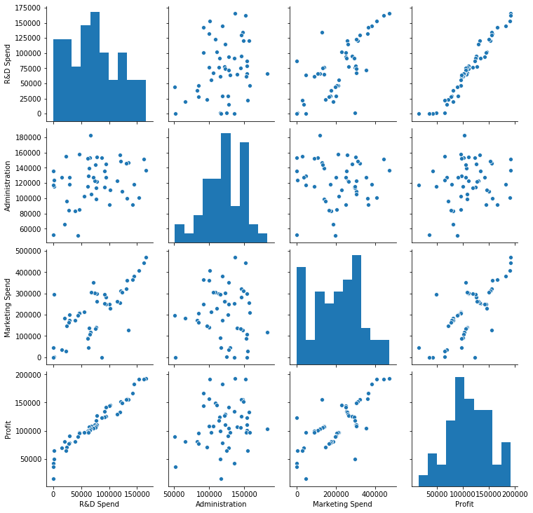
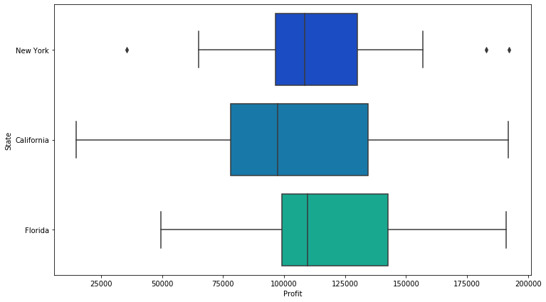
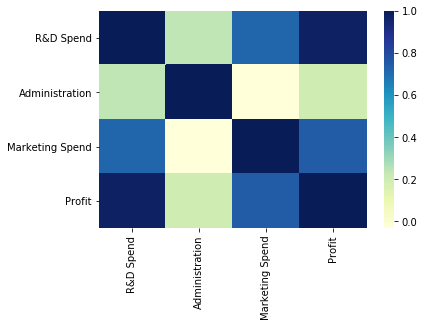
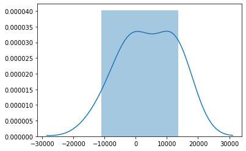

# Regresión Lineal Multiple


```python
# Importamos las librerias
import numpy as np
import matplotlib.pyplot as plt
import pandas as pd
import seaborn as sns
%matplotlib inline
```

## Cargar Datos

Los datos corresponden a 50 empresas emprendedoras, con las siguientes columnas:
* R&D Spend: gastos en Investigación y Desarrollo
* Administration: gastos en Administración
* Marketing Spend: gastos en Mercadotecnia
* State: estado en el que se ubica la compañía
* Profit: utilidad

El objetivo es generar un modelo que pueda predecir la utilidad que tendrá una nueva empresa, basándose en los gastos que realiza en las diferentes áreas y el estado en el que se ubica


```python
# Importar el conjunto de datos
dataset = pd.read_csv('50_Startups.csv')
X = dataset.iloc[:, :-1].values
y = dataset.iloc[:, 4].values
```

## Revisar los datos


```python
type(X)
```


    numpy.ndarray


```python
dataset.head()
```


<div>
<table border="1" class="dataframe">
  <thead>
    <tr style="text-align: right;">
      <th></th>
      <th>R&amp;D Spend</th>
      <th>Administration</th>
      <th>Marketing Spend</th>
      <th>State</th>
      <th>Profit</th>
    </tr>
  </thead>
  <tbody>
    <tr>
      <th>0</th>
      <td>165349.20</td>
      <td>136897.80</td>
      <td>471784.10</td>
      <td>New York</td>
      <td>192261.83</td>
    </tr>
    <tr>
      <th>1</th>
      <td>162597.70</td>
      <td>151377.59</td>
      <td>443898.53</td>
      <td>California</td>
      <td>191792.06</td>
    </tr>
    <tr>
      <th>2</th>
      <td>153441.51</td>
      <td>101145.55</td>
      <td>407934.54</td>
      <td>Florida</td>
      <td>191050.39</td>
    </tr>
    <tr>
      <th>3</th>
      <td>144372.41</td>
      <td>118671.85</td>
      <td>383199.62</td>
      <td>New York</td>
      <td>182901.99</td>
    </tr>
    <tr>
      <th>4</th>
      <td>142107.34</td>
      <td>91391.77</td>
      <td>366168.42</td>
      <td>Florida</td>
      <td>166187.94</td>
    </tr>
  </tbody>
</table>
</div>


```python
dataset.info()
```

    <class 'pandas.core.frame.DataFrame'>
    RangeIndex: 50 entries, 0 to 49
    Data columns (total 5 columns):
     #   Column           Non-Null Count  Dtype  
    ---  ------           --------------  -----  
     0   R&D Spend        50 non-null     float64
     1   Administration   50 non-null     float64
     2   Marketing Spend  50 non-null     float64
     3   State            50 non-null     object 
     4   Profit           50 non-null     float64
    dtypes: float64(4), object(1)
    memory usage: 2.1+ KB
    


```python
dataset.describe()
```


<div>
<table border="1" class="dataframe">
  <thead>
    <tr style="text-align: right;">
      <th></th>
      <th>R&amp;D Spend</th>
      <th>Administration</th>
      <th>Marketing Spend</th>
      <th>Profit</th>
    </tr>
  </thead>
  <tbody>
    <tr>
      <th>count</th>
      <td>50.000000</td>
      <td>50.000000</td>
      <td>50.000000</td>
      <td>50.000000</td>
    </tr>
    <tr>
      <th>mean</th>
      <td>73721.615600</td>
      <td>121344.639600</td>
      <td>211025.097800</td>
      <td>112012.639200</td>
    </tr>
    <tr>
      <th>std</th>
      <td>45902.256482</td>
      <td>28017.802755</td>
      <td>122290.310726</td>
      <td>40306.180338</td>
    </tr>
    <tr>
      <th>min</th>
      <td>0.000000</td>
      <td>51283.140000</td>
      <td>0.000000</td>
      <td>14681.400000</td>
    </tr>
    <tr>
      <th>25%</th>
      <td>39936.370000</td>
      <td>103730.875000</td>
      <td>129300.132500</td>
      <td>90138.902500</td>
    </tr>
    <tr>
      <th>50%</th>
      <td>73051.080000</td>
      <td>122699.795000</td>
      <td>212716.240000</td>
      <td>107978.190000</td>
    </tr>
    <tr>
      <th>75%</th>
      <td>101602.800000</td>
      <td>144842.180000</td>
      <td>299469.085000</td>
      <td>139765.977500</td>
    </tr>
    <tr>
      <th>max</th>
      <td>165349.200000</td>
      <td>182645.560000</td>
      <td>471784.100000</td>
      <td>192261.830000</td>
    </tr>
  </tbody>
</table>
</div>


## EDA (Análisis Exploratorio de Datos)


```python
sns.heatmap(dataset.isnull(),yticklabels=False,cbar=False,cmap='viridis')
```


    <matplotlib.axes._subplots.AxesSubplot at 0x2127207f988>





```python
#Despleguemos las correlaciones entre las diferentes características
sns.pairplot(dataset,palette='Set1')
```


    <seaborn.axisgrid.PairGrid at 0x21272066dc8>





```python
# Veamos la distribución por estado
plt.figure(figsize=(12, 7))
sns.boxplot(x='Profit',y='State',data=dataset,palette='winter')
```


    <matplotlib.axes._subplots.AxesSubplot at 0x21272cb7988>





```python
#Veamos la distribución de la utilidad
sns.distplot(dataset['Profit'])
```


    <matplotlib.axes._subplots.AxesSubplot at 0x21272fcae88>


```python
#Veamos la relación entre las características, mediante un mapa de calor
sns.heatmap(dataset.corr(),cmap="YlGnBu")
```


    <matplotlib.axes._subplots.AxesSubplot at 0x21272cc48c8>





## Codificar los datos categóricos


```python
from sklearn.preprocessing import LabelEncoder, OneHotEncoder
from sklearn.compose import ColumnTransformer

labelencoder_X = LabelEncoder()
X[:, 3] = labelencoder_X.fit_transform(X[:, 3])

ct = ColumnTransformer(
    [('one_hot_encoder', OneHotEncoder(drop='first'), [3])],    # Los números de columnas que serán transformados (en este caso [0], pero puede ser [0, 1, 3])
    remainder='passthrough'                         # No modificar el resto de las columnas
)
print(ct)
X = np.array(ct.fit_transform(X), dtype=np.float)
```

    ColumnTransformer(n_jobs=None, remainder='passthrough', sparse_threshold=0.3,
                      transformer_weights=None,
                      transformers=[('one_hot_encoder',
                                     OneHotEncoder(categories='auto', drop='first',
                                                   dtype=<class 'numpy.float64'>,
                                                   handle_unknown='error',
                                                   sparse=True),
                                     [3])],
                      verbose=False)
    


```python
print(X)
```

    [[0.0000000e+00 1.0000000e+00 1.6534920e+05 1.3689780e+05 4.7178410e+05]
     [0.0000000e+00 0.0000000e+00 1.6259770e+05 1.5137759e+05 4.4389853e+05]
     [1.0000000e+00 0.0000000e+00 1.5344151e+05 1.0114555e+05 4.0793454e+05]
     [0.0000000e+00 1.0000000e+00 1.4437241e+05 1.1867185e+05 3.8319962e+05]
     [1.0000000e+00 0.0000000e+00 1.4210734e+05 9.1391770e+04 3.6616842e+05]
     [0.0000000e+00 1.0000000e+00 1.3187690e+05 9.9814710e+04 3.6286136e+05]
     [0.0000000e+00 0.0000000e+00 1.3461546e+05 1.4719887e+05 1.2771682e+05]
     [1.0000000e+00 0.0000000e+00 1.3029813e+05 1.4553006e+05 3.2387668e+05]
     [0.0000000e+00 1.0000000e+00 1.2054252e+05 1.4871895e+05 3.1161329e+05]
     [0.0000000e+00 0.0000000e+00 1.2333488e+05 1.0867917e+05 3.0498162e+05]
     [1.0000000e+00 0.0000000e+00 1.0191308e+05 1.1059411e+05 2.2916095e+05]
     [0.0000000e+00 0.0000000e+00 1.0067196e+05 9.1790610e+04 2.4974455e+05]
     [1.0000000e+00 0.0000000e+00 9.3863750e+04 1.2732038e+05 2.4983944e+05]
     [0.0000000e+00 0.0000000e+00 9.1992390e+04 1.3549507e+05 2.5266493e+05]
     [1.0000000e+00 0.0000000e+00 1.1994324e+05 1.5654742e+05 2.5651292e+05]
     [0.0000000e+00 1.0000000e+00 1.1452361e+05 1.2261684e+05 2.6177623e+05]
     [0.0000000e+00 0.0000000e+00 7.8013110e+04 1.2159755e+05 2.6434606e+05]
     [0.0000000e+00 1.0000000e+00 9.4657160e+04 1.4507758e+05 2.8257431e+05]
     [1.0000000e+00 0.0000000e+00 9.1749160e+04 1.1417579e+05 2.9491957e+05]
     [0.0000000e+00 1.0000000e+00 8.6419700e+04 1.5351411e+05 0.0000000e+00]
     [0.0000000e+00 0.0000000e+00 7.6253860e+04 1.1386730e+05 2.9866447e+05]
     [0.0000000e+00 1.0000000e+00 7.8389470e+04 1.5377343e+05 2.9973729e+05]
     [1.0000000e+00 0.0000000e+00 7.3994560e+04 1.2278275e+05 3.0331926e+05]
     [1.0000000e+00 0.0000000e+00 6.7532530e+04 1.0575103e+05 3.0476873e+05]
     [0.0000000e+00 1.0000000e+00 7.7044010e+04 9.9281340e+04 1.4057481e+05]
     [0.0000000e+00 0.0000000e+00 6.4664710e+04 1.3955316e+05 1.3796262e+05]
     [1.0000000e+00 0.0000000e+00 7.5328870e+04 1.4413598e+05 1.3405007e+05]
     [0.0000000e+00 1.0000000e+00 7.2107600e+04 1.2786455e+05 3.5318381e+05]
     [1.0000000e+00 0.0000000e+00 6.6051520e+04 1.8264556e+05 1.1814820e+05]
     [0.0000000e+00 1.0000000e+00 6.5605480e+04 1.5303206e+05 1.0713838e+05]
     [1.0000000e+00 0.0000000e+00 6.1994480e+04 1.1564128e+05 9.1131240e+04]
     [0.0000000e+00 1.0000000e+00 6.1136380e+04 1.5270192e+05 8.8218230e+04]
     [0.0000000e+00 0.0000000e+00 6.3408860e+04 1.2921961e+05 4.6085250e+04]
     [1.0000000e+00 0.0000000e+00 5.5493950e+04 1.0305749e+05 2.1463481e+05]
     [0.0000000e+00 0.0000000e+00 4.6426070e+04 1.5769392e+05 2.1079767e+05]
     [0.0000000e+00 1.0000000e+00 4.6014020e+04 8.5047440e+04 2.0551764e+05]
     [1.0000000e+00 0.0000000e+00 2.8663760e+04 1.2705621e+05 2.0112682e+05]
     [0.0000000e+00 0.0000000e+00 4.4069950e+04 5.1283140e+04 1.9702942e+05]
     [0.0000000e+00 1.0000000e+00 2.0229590e+04 6.5947930e+04 1.8526510e+05]
     [0.0000000e+00 0.0000000e+00 3.8558510e+04 8.2982090e+04 1.7499930e+05]
     [0.0000000e+00 0.0000000e+00 2.8754330e+04 1.1854605e+05 1.7279567e+05]
     [1.0000000e+00 0.0000000e+00 2.7892920e+04 8.4710770e+04 1.6447071e+05]
     [0.0000000e+00 0.0000000e+00 2.3640930e+04 9.6189630e+04 1.4800111e+05]
     [0.0000000e+00 1.0000000e+00 1.5505730e+04 1.2738230e+05 3.5534170e+04]
     [0.0000000e+00 0.0000000e+00 2.2177740e+04 1.5480614e+05 2.8334720e+04]
     [0.0000000e+00 1.0000000e+00 1.0002300e+03 1.2415304e+05 1.9039300e+03]
     [1.0000000e+00 0.0000000e+00 1.3154600e+03 1.1581621e+05 2.9711446e+05]
     [0.0000000e+00 0.0000000e+00 0.0000000e+00 1.3542692e+05 0.0000000e+00]
     [0.0000000e+00 1.0000000e+00 5.4205000e+02 5.1743150e+04 0.0000000e+00]
     [0.0000000e+00 0.0000000e+00 0.0000000e+00 1.1698380e+05 4.5173060e+04]]
    

## Dividir el conjunto de datos en conjunto de entrenamiento y conjunto de pruebas


```python
from sklearn.model_selection import train_test_split
X_train, X_test, y_train, y_test = train_test_split(X, y, test_size = 0.2, random_state = 0)
```

## Ajustar el modelo de Regresión lineal múltiple con el conjunto de entrenamiento


```python
from sklearn.linear_model import LinearRegression
regression = LinearRegression()
regression.fit(X_train, y_train)
```


    LinearRegression(copy_X=True, fit_intercept=True, n_jobs=None, normalize=False)


## Evaluación


```python
#### imprimimos la intercepción
print(regression.intercept_)
```

    42554.16761772438
    


```python
Z=dataset[['R&D Spend','Administration','Marketing Spend','State','Profit']]
```


```python
regression.coef_
```


    array([-9.59284160e+02,  6.99369053e+02,  7.73467193e-01,  3.28845975e-02,
            3.66100259e-02])


```python
coeff_df = pd.DataFrame(regression.coef_,Z.columns,columns=['Coefficient'])
coeff_df
```


<div>
<table border="1" class="dataframe">
  <thead>
    <tr style="text-align: right;">
      <th></th>
      <th>Coefficient</th>
    </tr>
  </thead>
  <tbody>
    <tr>
      <th>R&amp;D Spend</th>
      <td>-959.284160</td>
    </tr>
    <tr>
      <th>Administration</th>
      <td>699.369053</td>
    </tr>
    <tr>
      <th>Marketing Spend</th>
      <td>0.773467</td>
    </tr>
    <tr>
      <th>State</th>
      <td>0.032885</td>
    </tr>
    <tr>
      <th>Profit</th>
      <td>0.036610</td>
    </tr>
  </tbody>
</table>
</div>


## Predicción de los resultados en el conjunto de pruebas


```python
y_pred = regression.predict(X_test)
```


```python
# Construir el modelo óptimo de Regresión Lineal utilizando la Eliminación hacia atrás
import statsmodels.formula.api as sm
X = np.append(arr = np.ones((50,1)).astype(int), values = X, axis = 1)
SL = 0.05
```


```python
#Veamos la relación entre los valores verdaderos y las predicciones
plt.scatter(y_test,y_pred)
```


    <matplotlib.collections.PathCollection at 0x21272f95d88>


```python
sns.distplot((y_test-y_pred))
```


    <matplotlib.axes._subplots.AxesSubplot at 0x212730d46c8>





```python
# Eva
from sklearn import metrics

print('MAE:', metrics.mean_absolute_error(y_test, y_pred))
print('MSE:', metrics.mean_squared_error(y_test, y_pred))
print('RMSE:', np.sqrt(metrics.mean_squared_error(y_test, y_pred)))
```

    MAE: 7514.293659640891
    MSE: 83502864.03257468
    RMSE: 9137.990152794797
    

## Visualización


```python
plt.scatter(y_test,y_pred)
```


    <matplotlib.collections.PathCollection at 0x1706e259b38>


## Construir el modelo óptimo de RLM utilizando la Eliminación hacia atrás


```python
import statsmodels.api as sm
```


```python
X = np.append(arr = np.ones((50,1)).astype(int), values = X, axis = 1)
SL = 0.05

```


```python
#Se ha añadido el modificador .tolist() al X_opt para adaptarse a Python 3.7

X_opt = X[:, [0, 1, 2, 3, 4, 5]]
regression_OLS = sm.OLS(endog = y, exog = X_opt.tolist()).fit()
#regression_OLS
regression_OLS.summary()
```


<table class="simpletable">
<caption>OLS Regression Results</caption>
<tr>
  <th>Dep. Variable:</th>            <td>y</td>        <th>  R-squared:         </th> <td>   0.000</td>
</tr>
<tr>
  <th>Model:</th>                   <td>OLS</td>       <th>  Adj. R-squared:    </th> <td>   0.000</td>
</tr>
<tr>
  <th>Method:</th>             <td>Least Squares</td>  <th>  F-statistic:       </th> <td>     nan</td>
</tr>
<tr>
  <th>Date:</th>             <td>Sun, 31 May 2020</td> <th>  Prob (F-statistic):</th>  <td>   nan</td> 
</tr>
<tr>
  <th>Time:</th>                 <td>01:37:32</td>     <th>  Log-Likelihood:    </th> <td> -600.65</td>
</tr>
<tr>
  <th>No. Observations:</th>      <td>    50</td>      <th>  AIC:               </th> <td>   1203.</td>
</tr>
<tr>
  <th>Df Residuals:</th>          <td>    49</td>      <th>  BIC:               </th> <td>   1205.</td>
</tr>
<tr>
  <th>Df Model:</th>              <td>     0</td>      <th>                     </th>     <td> </td>   
</tr>
<tr>
  <th>Covariance Type:</th>      <td>nonrobust</td>    <th>                     </th>     <td> </td>   
</tr>
</table>
<table class="simpletable">
<tr>
    <td></td>       <th>coef</th>     <th>std err</th>      <th>t</th>      <th>P>|t|</th>  <th>[0.025</th>    <th>0.975]</th>  
</tr>
<tr>
  <th>const</th> <td> 1.867e+04</td> <td>  950.026</td> <td>   19.651</td> <td> 0.000</td> <td> 1.68e+04</td> <td> 2.06e+04</td>
</tr>
<tr>
  <th>x1</th>    <td> 1.867e+04</td> <td>  950.026</td> <td>   19.651</td> <td> 0.000</td> <td> 1.68e+04</td> <td> 2.06e+04</td>
</tr>
<tr>
  <th>x2</th>    <td> 1.867e+04</td> <td>  950.026</td> <td>   19.651</td> <td> 0.000</td> <td> 1.68e+04</td> <td> 2.06e+04</td>
</tr>
<tr>
  <th>x3</th>    <td> 1.867e+04</td> <td>  950.026</td> <td>   19.651</td> <td> 0.000</td> <td> 1.68e+04</td> <td> 2.06e+04</td>
</tr>
<tr>
  <th>x4</th>    <td> 1.867e+04</td> <td>  950.026</td> <td>   19.651</td> <td> 0.000</td> <td> 1.68e+04</td> <td> 2.06e+04</td>
</tr>
<tr>
  <th>x5</th>    <td> 1.867e+04</td> <td>  950.026</td> <td>   19.651</td> <td> 0.000</td> <td> 1.68e+04</td> <td> 2.06e+04</td>
</tr>
</table>
<table class="simpletable">
<tr>
  <th>Omnibus:</th>       <td> 0.018</td> <th>  Durbin-Watson:     </th> <td>   0.020</td>
</tr>
<tr>
  <th>Prob(Omnibus):</th> <td> 0.991</td> <th>  Jarque-Bera (JB):  </th> <td>   0.068</td>
</tr>
<tr>
  <th>Skew:</th>          <td> 0.023</td> <th>  Prob(JB):          </th> <td>   0.966</td>
</tr>
<tr>
  <th>Kurtosis:</th>      <td> 2.825</td> <th>  Cond. No.          </th> <td>1.97e+80</td>
</tr>
</table><br/><br/>Warnings:<br/>[1] Standard Errors assume that the covariance matrix of the errors is correctly specified.<br/>[2] The smallest eigenvalue is 7.74e-159. This might indicate that there are<br/>strong multicollinearity problems or that the design matrix is singular.


```python
X_opt = X[:, [0, 1, 3, 4, 5]]
regression_OLS = sm.OLS(endog = y, exog = X_opt.tolist()).fit()
regression_OLS.summary()
```


<table class="simpletable">
<caption>OLS Regression Results</caption>
<tr>
  <th>Dep. Variable:</th>            <td>y</td>        <th>  R-squared:         </th> <td>   0.000</td>
</tr>
<tr>
  <th>Model:</th>                   <td>OLS</td>       <th>  Adj. R-squared:    </th> <td>   0.000</td>
</tr>
<tr>
  <th>Method:</th>             <td>Least Squares</td>  <th>  F-statistic:       </th> <td>     nan</td>
</tr>
<tr>
  <th>Date:</th>             <td>Sun, 31 May 2020</td> <th>  Prob (F-statistic):</th>  <td>   nan</td> 
</tr>
<tr>
  <th>Time:</th>                 <td>01:37:36</td>     <th>  Log-Likelihood:    </th> <td> -600.65</td>
</tr>
<tr>
  <th>No. Observations:</th>      <td>    50</td>      <th>  AIC:               </th> <td>   1203.</td>
</tr>
<tr>
  <th>Df Residuals:</th>          <td>    49</td>      <th>  BIC:               </th> <td>   1205.</td>
</tr>
<tr>
  <th>Df Model:</th>              <td>     0</td>      <th>                     </th>     <td> </td>   
</tr>
<tr>
  <th>Covariance Type:</th>      <td>nonrobust</td>    <th>                     </th>     <td> </td>   
</tr>
</table>
<table class="simpletable">
<tr>
    <td></td>       <th>coef</th>     <th>std err</th>      <th>t</th>      <th>P>|t|</th>  <th>[0.025</th>    <th>0.975]</th>  
</tr>
<tr>
  <th>const</th> <td>  2.24e+04</td> <td> 1140.031</td> <td>   19.651</td> <td> 0.000</td> <td> 2.01e+04</td> <td> 2.47e+04</td>
</tr>
<tr>
  <th>x1</th>    <td>  2.24e+04</td> <td> 1140.031</td> <td>   19.651</td> <td> 0.000</td> <td> 2.01e+04</td> <td> 2.47e+04</td>
</tr>
<tr>
  <th>x2</th>    <td>  2.24e+04</td> <td> 1140.031</td> <td>   19.651</td> <td> 0.000</td> <td> 2.01e+04</td> <td> 2.47e+04</td>
</tr>
<tr>
  <th>x3</th>    <td>  2.24e+04</td> <td> 1140.031</td> <td>   19.651</td> <td> 0.000</td> <td> 2.01e+04</td> <td> 2.47e+04</td>
</tr>
<tr>
  <th>x4</th>    <td>  2.24e+04</td> <td> 1140.031</td> <td>   19.651</td> <td> 0.000</td> <td> 2.01e+04</td> <td> 2.47e+04</td>
</tr>
</table>
<table class="simpletable">
<tr>
  <th>Omnibus:</th>       <td> 0.018</td> <th>  Durbin-Watson:     </th> <td>   0.020</td>
</tr>
<tr>
  <th>Prob(Omnibus):</th> <td> 0.991</td> <th>  Jarque-Bera (JB):  </th> <td>   0.068</td>
</tr>
<tr>
  <th>Skew:</th>          <td> 0.023</td> <th>  Prob(JB):          </th> <td>   0.966</td>
</tr>
<tr>
  <th>Kurtosis:</th>      <td> 2.825</td> <th>  Cond. No.          </th> <td>1.61e+64</td>
</tr>
</table><br/><br/>Warnings:<br/>[1] Standard Errors assume that the covariance matrix of the errors is correctly specified.<br/>[2] The smallest eigenvalue is 9.66e-127. This might indicate that there are<br/>strong multicollinearity problems or that the design matrix is singular.


```python
X_opt = X[:, [0, 3, 4, 5]]
regression_OLS = sm.OLS(endog = y, exog = X_opt.tolist()).fit()
regression_OLS.summary()
```


<table class="simpletable">
<caption>OLS Regression Results</caption>
<tr>
  <th>Dep. Variable:</th>            <td>y</td>        <th>  R-squared:         </th> <td>   0.000</td>
</tr>
<tr>
  <th>Model:</th>                   <td>OLS</td>       <th>  Adj. R-squared:    </th> <td>   0.000</td>
</tr>
<tr>
  <th>Method:</th>             <td>Least Squares</td>  <th>  F-statistic:       </th> <td>     nan</td>
</tr>
<tr>
  <th>Date:</th>             <td>Sun, 31 May 2020</td> <th>  Prob (F-statistic):</th>  <td>   nan</td> 
</tr>
<tr>
  <th>Time:</th>                 <td>01:37:54</td>     <th>  Log-Likelihood:    </th> <td> -600.65</td>
</tr>
<tr>
  <th>No. Observations:</th>      <td>    50</td>      <th>  AIC:               </th> <td>   1203.</td>
</tr>
<tr>
  <th>Df Residuals:</th>          <td>    49</td>      <th>  BIC:               </th> <td>   1205.</td>
</tr>
<tr>
  <th>Df Model:</th>              <td>     0</td>      <th>                     </th>     <td> </td>   
</tr>
<tr>
  <th>Covariance Type:</th>      <td>nonrobust</td>    <th>                     </th>     <td> </td>   
</tr>
</table>
<table class="simpletable">
<tr>
    <td></td>       <th>coef</th>     <th>std err</th>      <th>t</th>      <th>P>|t|</th>  <th>[0.025</th>    <th>0.975]</th>  
</tr>
<tr>
  <th>const</th> <td>   2.8e+04</td> <td> 1425.039</td> <td>   19.651</td> <td> 0.000</td> <td> 2.51e+04</td> <td> 3.09e+04</td>
</tr>
<tr>
  <th>x1</th>    <td>   2.8e+04</td> <td> 1425.039</td> <td>   19.651</td> <td> 0.000</td> <td> 2.51e+04</td> <td> 3.09e+04</td>
</tr>
<tr>
  <th>x2</th>    <td>   2.8e+04</td> <td> 1425.039</td> <td>   19.651</td> <td> 0.000</td> <td> 2.51e+04</td> <td> 3.09e+04</td>
</tr>
<tr>
  <th>x3</th>    <td>   2.8e+04</td> <td> 1425.039</td> <td>   19.651</td> <td> 0.000</td> <td> 2.51e+04</td> <td> 3.09e+04</td>
</tr>
</table>
<table class="simpletable">
<tr>
  <th>Omnibus:</th>       <td> 0.018</td> <th>  Durbin-Watson:     </th> <td>   0.020</td>
</tr>
<tr>
  <th>Prob(Omnibus):</th> <td> 0.991</td> <th>  Jarque-Bera (JB):  </th> <td>   0.068</td>
</tr>
<tr>
  <th>Skew:</th>          <td> 0.023</td> <th>  Prob(JB):          </th> <td>   0.966</td>
</tr>
<tr>
  <th>Kurtosis:</th>      <td> 2.825</td> <th>  Cond. No.          </th> <td>1.47e+48</td>
</tr>
</table><br/><br/>Warnings:<br/>[1] Standard Errors assume that the covariance matrix of the errors is correctly specified.<br/>[2] The smallest eigenvalue is 9.2e-95. This might indicate that there are<br/>strong multicollinearity problems or that the design matrix is singular.


```python


X_opt = X[:, [0, 3, 5]]
regression_OLS = sm.OLS(endog = y, exog = X_opt.tolist()).fit()
regression_OLS.summary()
```


<table class="simpletable">
<caption>OLS Regression Results</caption>
<tr>
  <th>Dep. Variable:</th>            <td>y</td>        <th>  R-squared:         </th> <td>   0.000</td>
</tr>
<tr>
  <th>Model:</th>                   <td>OLS</td>       <th>  Adj. R-squared:    </th> <td>   0.000</td>
</tr>
<tr>
  <th>Method:</th>             <td>Least Squares</td>  <th>  F-statistic:       </th> <td>     nan</td>
</tr>
<tr>
  <th>Date:</th>             <td>Sun, 31 May 2020</td> <th>  Prob (F-statistic):</th>  <td>   nan</td> 
</tr>
<tr>
  <th>Time:</th>                 <td>01:37:57</td>     <th>  Log-Likelihood:    </th> <td> -600.65</td>
</tr>
<tr>
  <th>No. Observations:</th>      <td>    50</td>      <th>  AIC:               </th> <td>   1203.</td>
</tr>
<tr>
  <th>Df Residuals:</th>          <td>    49</td>      <th>  BIC:               </th> <td>   1205.</td>
</tr>
<tr>
  <th>Df Model:</th>              <td>     0</td>      <th>                     </th>     <td> </td>   
</tr>
<tr>
  <th>Covariance Type:</th>      <td>nonrobust</td>    <th>                     </th>     <td> </td>   
</tr>
</table>
<table class="simpletable">
<tr>
    <td></td>       <th>coef</th>     <th>std err</th>      <th>t</th>      <th>P>|t|</th>  <th>[0.025</th>    <th>0.975]</th>  
</tr>
<tr>
  <th>const</th> <td> 3.734e+04</td> <td> 1900.052</td> <td>   19.651</td> <td> 0.000</td> <td> 3.35e+04</td> <td> 4.12e+04</td>
</tr>
<tr>
  <th>x1</th>    <td> 3.734e+04</td> <td> 1900.052</td> <td>   19.651</td> <td> 0.000</td> <td> 3.35e+04</td> <td> 4.12e+04</td>
</tr>
<tr>
  <th>x2</th>    <td> 3.734e+04</td> <td> 1900.052</td> <td>   19.651</td> <td> 0.000</td> <td> 3.35e+04</td> <td> 4.12e+04</td>
</tr>
</table>
<table class="simpletable">
<tr>
  <th>Omnibus:</th>       <td> 0.018</td> <th>  Durbin-Watson:     </th> <td>   0.020</td>
</tr>
<tr>
  <th>Prob(Omnibus):</th> <td> 0.991</td> <th>  Jarque-Bera (JB):  </th> <td>   0.068</td>
</tr>
<tr>
  <th>Skew:</th>          <td> 0.023</td> <th>  Prob(JB):          </th> <td>   0.966</td>
</tr>
<tr>
  <th>Kurtosis:</th>      <td> 2.825</td> <th>  Cond. No.          </th> <td>4.06e+32</td>
</tr>
</table><br/><br/>Warnings:<br/>[1] Standard Errors assume that the covariance matrix of the errors is correctly specified.<br/>[2] The smallest eigenvalue is 9.12e-64. This might indicate that there are<br/>strong multicollinearity problems or that the design matrix is singular.


```python
X_opt = X[:, [0, 3]]
regression_OLS = sm.OLS(endog = y, exog = X_opt.tolist()).fit()
regression_OLS.summary()
```


<table class="simpletable">
<caption>OLS Regression Results</caption>
<tr>
  <th>Dep. Variable:</th>            <td>y</td>        <th>  R-squared:         </th> <td>   0.000</td>
</tr>
<tr>
  <th>Model:</th>                   <td>OLS</td>       <th>  Adj. R-squared:    </th> <td>   0.000</td>
</tr>
<tr>
  <th>Method:</th>             <td>Least Squares</td>  <th>  F-statistic:       </th> <td>     nan</td>
</tr>
<tr>
  <th>Date:</th>             <td>Sun, 31 May 2020</td> <th>  Prob (F-statistic):</th>  <td>   nan</td> 
</tr>
<tr>
  <th>Time:</th>                 <td>01:38:01</td>     <th>  Log-Likelihood:    </th> <td> -600.65</td>
</tr>
<tr>
  <th>No. Observations:</th>      <td>    50</td>      <th>  AIC:               </th> <td>   1203.</td>
</tr>
<tr>
  <th>Df Residuals:</th>          <td>    49</td>      <th>  BIC:               </th> <td>   1205.</td>
</tr>
<tr>
  <th>Df Model:</th>              <td>     0</td>      <th>                     </th>     <td> </td>   
</tr>
<tr>
  <th>Covariance Type:</th>      <td>nonrobust</td>    <th>                     </th>     <td> </td>   
</tr>
</table>
<table class="simpletable">
<tr>
    <td></td>       <th>coef</th>     <th>std err</th>      <th>t</th>      <th>P>|t|</th>  <th>[0.025</th>    <th>0.975]</th>  
</tr>
<tr>
  <th>const</th> <td> 5.601e+04</td> <td> 2850.077</td> <td>   19.651</td> <td> 0.000</td> <td> 5.03e+04</td> <td> 6.17e+04</td>
</tr>
<tr>
  <th>x1</th>    <td> 5.601e+04</td> <td> 2850.077</td> <td>   19.651</td> <td> 0.000</td> <td> 5.03e+04</td> <td> 6.17e+04</td>
</tr>
</table>
<table class="simpletable">
<tr>
  <th>Omnibus:</th>       <td> 0.018</td> <th>  Durbin-Watson:     </th> <td>   0.020</td>
</tr>
<tr>
  <th>Prob(Omnibus):</th> <td> 0.991</td> <th>  Jarque-Bera (JB):  </th> <td>   0.068</td>
</tr>
<tr>
  <th>Skew:</th>          <td> 0.023</td> <th>  Prob(JB):          </th> <td>   0.966</td>
</tr>
<tr>
  <th>Kurtosis:</th>      <td> 2.825</td> <th>  Cond. No.          </th> <td>4.91e+16</td>
</tr>
</table><br/><br/>Warnings:<br/>[1] Standard Errors assume that the covariance matrix of the errors is correctly specified.<br/>[2] The smallest eigenvalue is 4.15e-32. This might indicate that there are<br/>strong multicollinearity problems or that the design matrix is singular.


