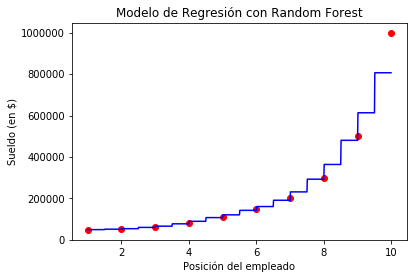

# Regresión con Bosques Aleatorios

**Contexto**  
Este conjunto de datos consiste en una lista de puestos en una empresa junto con los niveles y su salario asociado.

**Contenido**  
El conjunto de datos incluye columnas para el Puesto con valores que van desde Analista de negocios, Consultor junior hasta CEO, Nivel que varía de 1 a 10 y, finalmente, el Salario asociado con cada puesto que varía de **45,000 a 1,000,000**.

**Planteamiento del problema**  
El enunciado del problema es que el candidato con nivel 6.5 tenía un salario anterior de 160,000. Para contratar al candidato para un nuevo puesto, a la compañía le gustaría confirmar si está siendo honesto acerca de su último salario para que pueda tomar una decisión de contratación . Para hacer esto, haremos uso del método de Regresión Polinómicapara predecir el salario exacto del empleado.


```python
#Importar las librerías
import numpy as np
import matplotlib.pyplot as plt
import pandas as pd
```


```python
# Importar el data set
dataset = pd.read_csv('Position_Salaries.csv')
print(dataset)
X = dataset.iloc[:, 1:2].values
y = dataset.iloc[:, 2].values
```

                Position  Level   Salary
    0   Business Analyst      1    45000
    1  Junior Consultant      2    50000
    2  Senior Consultant      3    60000
    3            Manager      4    80000
    4    Country Manager      5   110000
    5     Region Manager      6   150000
    6            Partner      7   200000
    7     Senior Partner      8   300000
    8            C-level      9   500000
    9                CEO     10  1000000
    


```python
# Generar el Random Forest con el dataset
from sklearn.ensemble import RandomForestRegressor
regression = RandomForestRegressor(n_estimators = 300, random_state = 0)
regression.fit(X, y)
```


    RandomForestRegressor(bootstrap=True, ccp_alpha=0.0, criterion='mse',
                          max_depth=None, max_features='auto', max_leaf_nodes=None,
                          max_samples=None, min_impurity_decrease=0.0,
                          min_impurity_split=None, min_samples_leaf=1,
                          min_samples_split=2, min_weight_fraction_leaf=0.0,
                          n_estimators=300, n_jobs=None, oob_score=False,
                          random_state=0, verbose=0, warm_start=False)


```python
# Predicción de nuestros modelos con Random Forest
y_pred = regression.predict([[6.5]])
```


```python
# Visualización de los resultados del Random Forest
X_grid = np.arange(min(X), max(X), 0.01)
X_grid = X_grid.reshape(len(X_grid), 1)
plt.scatter(X, y, color = "red")
plt.plot(X_grid, regression.predict(X_grid), color = "blue")
plt.title("Modelo de Regresión con Random Forest")
plt.xlabel("Posición del empleado")
plt.ylabel("Sueldo (en $)")
plt.show()
print()
print('Precisión del modelo:')
print(regression.score(X, y))
```





    
    Precisión del modelo:
    0.952881406729914
    
