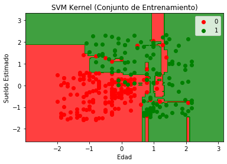
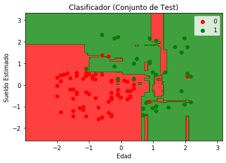

# Random Forest Classification

**Diccionario de datos**


Variable|Definición|Llave
-- | --| --
User Id|Número de cliente|
Gender|Género|Male, Female
Age|Edad|
EstimatedSalary|Sueldo estimado|
Purchased|Si realizó una compra o no|0 = no, 1 = si

**Notas**  
Se busca que el modelo prediga si el cliente realizará una compra o no, basándose en las demás características  


```python
# Importar las librerías
import numpy as np
import matplotlib.pyplot as plt
import pandas as pd
```


```python
# Importar el data set
dataset = pd.read_csv('Social_Network_Ads.csv')
print(dataset)
X = dataset.iloc[:, [2,3]].values
y = dataset.iloc[:, 4].values
```

          User ID  Gender   Age  EstimatedSalary  Purchased
    0    15624510    Male  19.0          19000.0          0
    1    15810944    Male  35.0          20000.0          0
    2    15668575  Female  26.0          43000.0          0
    3    15603246  Female  27.0          57000.0          0
    4    15804002    Male  19.0          76000.0          0
    ..        ...     ...   ...              ...        ...
    395  15691863  Female  46.0          41000.0          1
    396  15706071    Male  51.0          23000.0          1
    397  15654296  Female  50.0          20000.0          1
    398  15755018    Male  36.0          33000.0          0
    399  15594041  Female  49.0          36000.0          1
    
    [400 rows x 5 columns]
    


```python
# Dividir el conjunto de datos en conjunto de entrenamiento y conjunto de prueba
from sklearn.model_selection import train_test_split
X_train, X_test, y_train, y_test = train_test_split(X, y, test_size = 0.25, random_state = 0)
```


```python
# Escalado de variables
from sklearn.preprocessing import StandardScaler
sc_X = StandardScaler()
X_train = sc_X.fit_transform(X_train)
X_test = sc_X.transform(X_test)
```


```python
# Entrenar el clasificador Random Forest con el Conjunto de Entrenamiento
from sklearn.ensemble import RandomForestClassifier
classifier = RandomForestClassifier(n_estimators = 10, criterion = "entropy", random_state = 0)
classifier.fit(X_train, y_train)
```


    RandomForestClassifier(criterion='entropy', n_estimators=10, random_state=0)


```python
# Predicción de los resultados con el Conjunto de Prueba
y_pred  = classifier.predict(X_test)
```


```python
# Elaborar una matriz de confusión
from sklearn.metrics import confusion_matrix
cm = confusion_matrix(y_test, y_pred)
cm
```


    array([[63,  5],
           [ 4, 28]], dtype=int64)


```python
# Representación gráfica de los resultados del algoritmo en el Conjunto de Entrenamiento
from matplotlib.colors import ListedColormap
X_set, y_set = X_train, y_train
X1, X2 = np.meshgrid(np.arange(start = X_set[:, 0].min() - 1, stop = X_set[:, 0].max() + 1, step = 0.01),
                     np.arange(start = X_set[:, 1].min() - 1, stop = X_set[:, 1].max() + 1, step = 0.01))
plt.contourf(X1, X2, classifier.predict(np.array([X1.ravel(), X2.ravel()]).T).reshape(X1.shape),
             alpha = 0.75, cmap = ListedColormap(('red', 'green')))
plt.xlim(X1.min(), X1.max())
plt.ylim(X2.min(), X2.max())
for i, j in enumerate(np.unique(y_set)):
    plt.scatter(X_set[y_set == j, 0], X_set[y_set == j, 1],
                color = ListedColormap(('red', 'green'))(i), label = j)
plt.title('SVM Kernel (Conjunto de Entrenamiento)')
plt.xlabel('Edad')
plt.ylabel('Sueldo Estimado')
plt.legend()
plt.show()
```





```python
# Representación gráfica de los resultados del algoritmo en el Conjunto de Prueba
X_set, y_set = X_test, y_test
X1, X2 = np.meshgrid(np.arange(start = X_set[:, 0].min() - 1, stop = X_set[:, 0].max() + 1, step = 0.01),
                     np.arange(start = X_set[:, 1].min() - 1, stop = X_set[:, 1].max() + 1, step = 0.01))
plt.contourf(X1, X2, classifier.predict(np.array([X1.ravel(), X2.ravel()]).T).reshape(X1.shape),
             alpha = 0.75, cmap = ListedColormap(('red', 'green')))
plt.xlim(X1.min(), X1.max())
plt.ylim(X2.min(), X2.max())
for i, j in enumerate(np.unique(y_set)):
    plt.scatter(X_set[y_set == j, 0], X_set[y_set == j, 1],
                color = ListedColormap(('red', 'green'))(i), label = j)
plt.title('Clasificador (Conjunto de Test)')
plt.xlabel('Edad')
plt.ylabel('Sueldo Estimado')
plt.legend()
plt.show()
```




