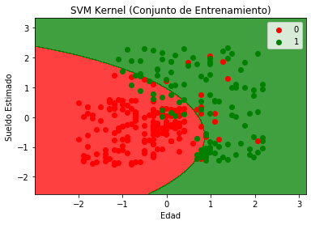
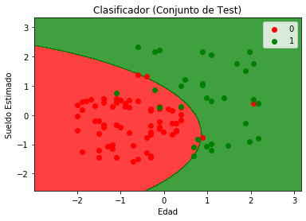

# Naïve Bayes

**Diccionario de datos**


Variable|Definición|Llave
-- | --| --
User Id|Número de cliente|
Gender|Género|Male, Female
Age|Edad|
EstimatedSalary|Sueldo estimado|
Purchased|Si realizó una compra o no|0 = no, 1 = si

**Notas**  
Se busca que el modelo prediga si el cliente realizará una compra o no, basándose en las demás características  

### Importar las librerías


```python

```

### Importar los datos y crear la variable X con la columna AGE & EstimetedSalary, la variable "y" con Purchased


```python
#Escribe tu código aqui

```


```python

```

          User ID  Gender   Age  EstimatedSalary  Purchased
    0    15624510    Male  19.0          19000.0          0
    1    15810944    Male  35.0          20000.0          0
    2    15668575  Female  26.0          43000.0          0
    3    15603246  Female  27.0          57000.0          0
    4    15804002    Male  19.0          76000.0          0
    ..        ...     ...   ...              ...        ...
    395  15691863  Female  46.0          41000.0          1
    396  15706071    Male  51.0          23000.0          1
    397  15654296  Female  50.0          20000.0          1
    398  15755018    Male  36.0          33000.0          0
    399  15594041  Female  49.0          36000.0          1
    
    [400 rows x 5 columns]
    

###  Dividir el data set en conjunto de entrenamiento y conjunto de testing


```python

```

### Escalar las variables X_train & X_test


```python

```

### Ajustar el clasificador en el Conjunto de Entrenamiento, utilizar sklearn.naive_bayes & GaussianNB


```python
#Escribe tu código aqui

```


```python

```


    GaussianNB(priors=None, var_smoothing=1e-09)


### Predicción de los resultados con el Conjunto de Pruebas


```python

```

### Elaborar una matriz de confusión y reporte de clasificación


```python
#Escribe tu código aqui

```


```python

```

    Confusion matrix: 
    [[65  3]
     [ 7 25]]
    Classification report:
                  precision    recall  f1-score   support
    
               0       0.90      0.96      0.93        68
               1       0.89      0.78      0.83        32
    
        accuracy                           0.90       100
       macro avg       0.90      0.87      0.88       100
    weighted avg       0.90      0.90      0.90       100
    
    


```python
# Representación gráfica de los resultados del algoritmo en el Conjunto de Entrenamiento
from matplotlib.colors import ListedColormap
X_set, y_set = X_train_std, y_train
X1, X2 = np.meshgrid(np.arange(start = X_set[:, 0].min() - 1, stop = X_set[:, 0].max() + 1, step = 0.01),
                     np.arange(start = X_set[:, 1].min() - 1, stop = X_set[:, 1].max() + 1, step = 0.01))
plt.contourf(X1, X2, nb.predict(np.array([X1.ravel(), X2.ravel()]).T).reshape(X1.shape),
             alpha = 0.75, cmap = ListedColormap(('red', 'green')))
plt.xlim(X1.min(), X1.max())
plt.ylim(X2.min(), X2.max())
for i, j in enumerate(np.unique(y_set)):
    plt.scatter(X_set[y_set == j, 0], X_set[y_set == j, 1],
                color = ListedColormap(('red', 'green'))(i), label = j)
plt.title('SVM Kernel (Conjunto de Entrenamiento)')
plt.xlabel('Edad')
plt.ylabel('Sueldo Estimado')
plt.legend()
plt.show()
```





```python
# Representación gráfica de los resultados del algoritmo en el Conjunto de Testing
X_set, y_set = X_test_std, y_test
X1, X2 = np.meshgrid(np.arange(start = X_set[:, 0].min() - 1, stop = X_set[:, 0].max() + 1, step = 0.01),
                     np.arange(start = X_set[:, 1].min() - 1, stop = X_set[:, 1].max() + 1, step = 0.01))
plt.contourf(X1, X2, nb.predict(np.array([X1.ravel(), X2.ravel()]).T).reshape(X1.shape),
             alpha = 0.75, cmap = ListedColormap(('red', 'green')))
plt.xlim(X1.min(), X1.max())
plt.ylim(X2.min(), X2.max())
for i, j in enumerate(np.unique(y_set)):
    plt.scatter(X_set[y_set == j, 0], X_set[y_set == j, 1],
                color = ListedColormap(('red', 'green'))(i), label = j)
plt.title('Clasificador (Conjunto de Test)')
plt.xlabel('Edad')
plt.ylabel('Sueldo Estimado')
plt.legend()
plt.show()
```




