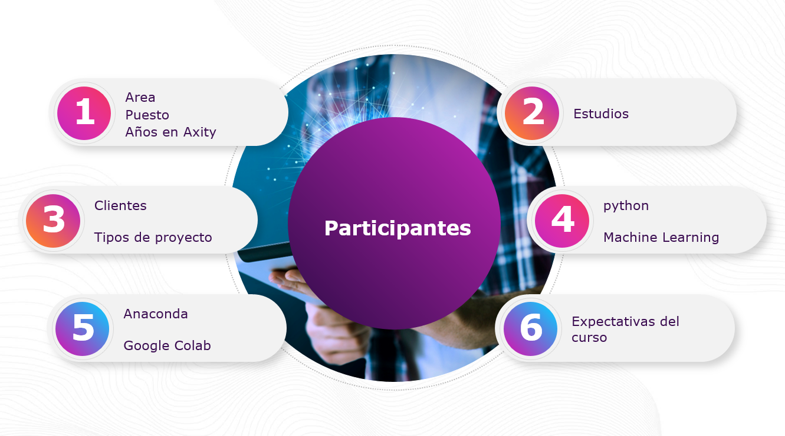

# Bienvenidos al curso **Machine Learning**

## Duración y horarios
* La duración del curso es de 3 días, en un horario de 9 am a 6 pm.
* La hora de comida se tomará de 1:30 pm a 2:30 pm.
* Se tendrán 2 recesos al día de 15 min.

&nbsp;
&nbsp;

## Presentación de participantes al curso

&nbsp;
&nbsp;

## Agenda

* Lección 01 - Introducción
* Lección 02 - Regresiones
* Lección 03 - Clasificación
* Lección 04 - Clustering
* Lección 05 - Reglas de Asociación

&nbsp;
&nbsp;

&nbsp;
&nbsp;