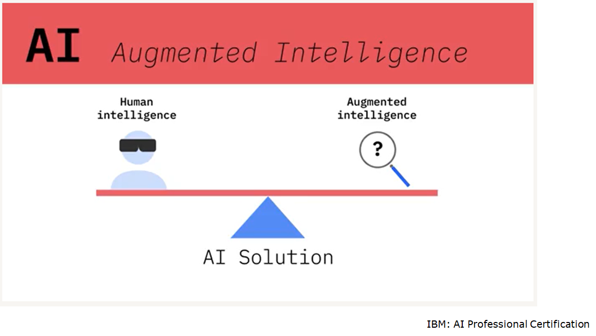
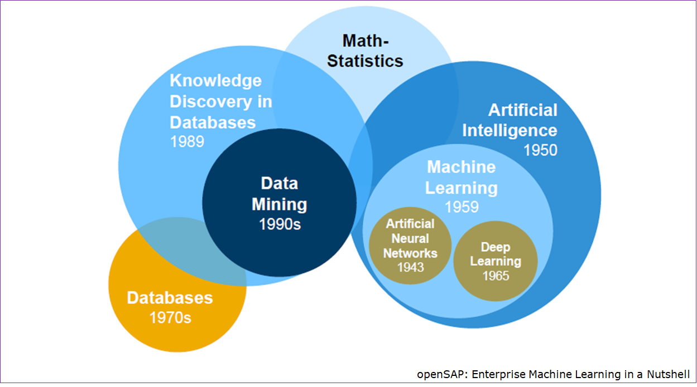
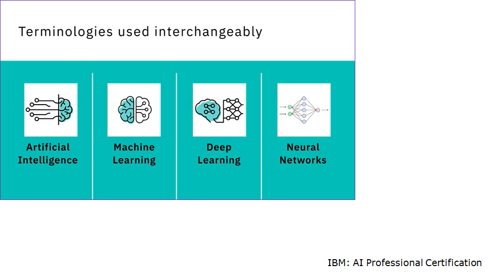
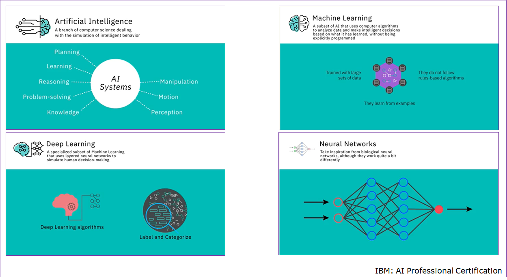
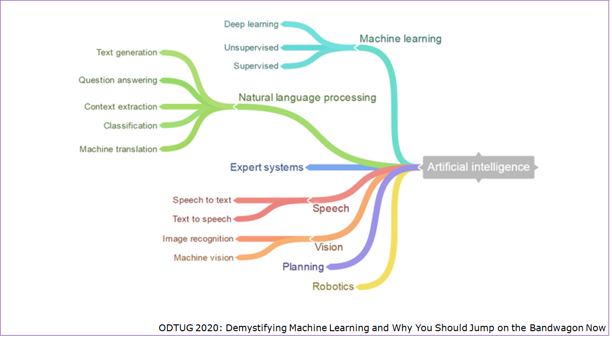

# Introducción

## ¿Qué es Inteligencia Artificial?

"Es *inteligencia* demostrada por máquinas, a diferencia de la *inteligencia* mostrada por los seres humanos u otros animales"  
-- [Wikipedia](https://en.wikipedia.org/wiki/Artificial_intelligence)

"Es un conjunto de tecnologías que permite a las computadoras, realizar varias funciones avanzadas, inluyendo la habilidad de ver, entender y traducir lenguaje hablado y escrito, analizar datos, realizar recomendaciones y mucho más"  
-- [Google Cloud](https://cloud.google.com/learn/what-is-artificial-intelligence)

## Terminología

## Programación Tradicional y Machine Learning

## Tipos de Aprendizaje en Machine Learning

