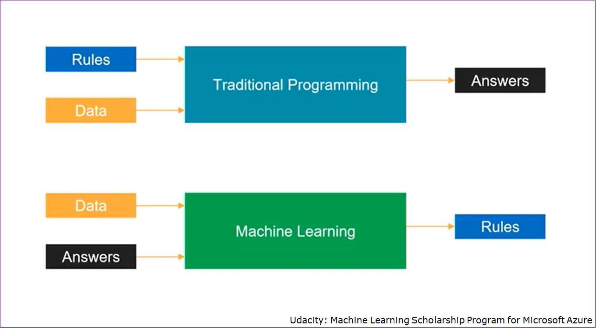
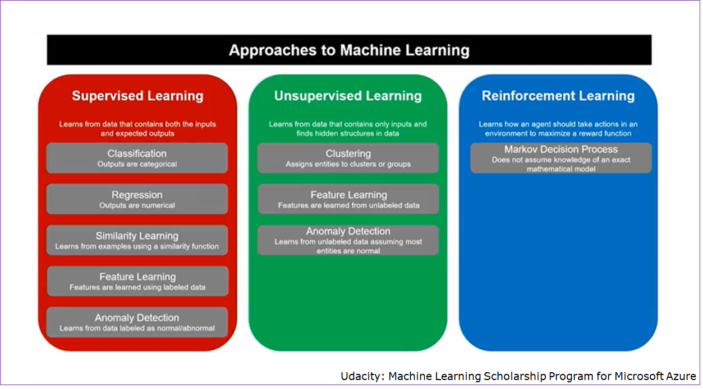
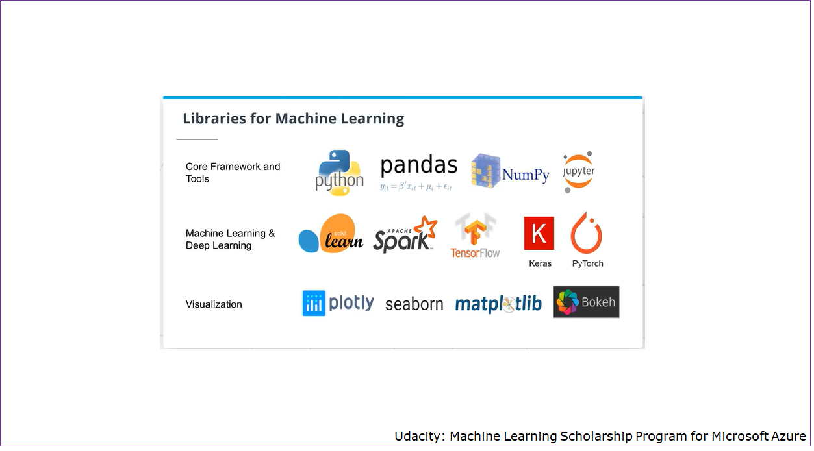

# Introducción

## ¿Qué es Inteligencia Artificial? (AI)

"Es la inteligencia demostrada por máquinas, a diferencia de la inteligencia mostrada por los seres humanos u otros animales"  
--[Wikipedia](https://en.wikipedia.org/wiki/Artificial_intelligence)

"Es la capacidad de un sistema de cómputo, para imitar funciones cognitivas realizadas por los seres humanos, como aprendizaje y solución de problemas"  
-- [Azure](https://azure.microsoft.com/en-au/resources/cloud-computing-dictionary/what-is-artificial-intelligence/)

"Es la especialidad de las ciencias computacionales, dedicada a resolver problemas cognitivos, asociados comunmente con la inteligencia humana, como aprendizaje, solución de problemas y reconocimiento de patrones"  
-- [AWS](https://aws.amazon.com/machine-learning/what-is-ai/)

"Es un conjunto de tecnologías que permite a las computadoras, realizar varias funciones avanzadas, inluyendo la habilidad de ver, entender y traducir lenguaje hablado y escrito, analizar datos, realizar recomendaciones y mucho más"  
-- [Google Cloud](https://cloud.google.com/learn/what-is-artificial-intelligence)

"Potencia a las computadoras y máquinas para imitar las capacidades de la menta humana, en la solución de problemas y toma de decisiones"  
-- [IBM](https://www.ibm.com/topics/artificial-intelligence)

**AI** busca aumentar la inteligencia de los seres humanos, no sustituirla (idealmente).

## Terminología

Dentro del ámbito de **AI**, se manejan varios términos. Las siguientes imágenes muestran la relación entre ellos.

Algunos de los diferentes tipos de aplicaciones que pueden desarrollarse mediante **AI**, se muestran en la siguiente imagen (con sus diferentes divisiones).

## Programación Tradicional y Machine Learning (ML)

**ML** utiliza un nuevo paradigma de programación.

## Tipos de Aprendizaje en Machine Learning

Existen 3 maneras principales para desarrollar los modelos en **ML**

## Ecosistema de ML

De manera general, está conformado por:

| Ambientes de Desarrollo | Librerias    | Servicios en la Nube |
|-------------------------|--------------|----------------------|
| Jupyter Notebooks       | scikit-learn | Azure                |
| Cloud Notebooks         | Keras        | AWS                  |
| Visual Studio           | TensorFlow   | Google Cloud         |
|                         | PyTorch      |                      |

## Ejemplos de Librerías

